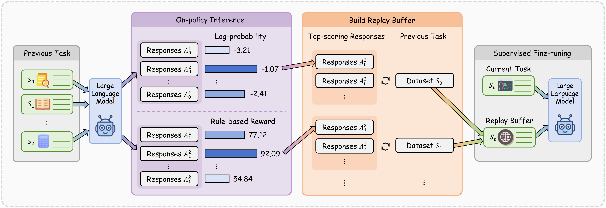

# On-Policy Replay for Continual Supervised Fine-Tuning

<p align="center">
  <a href="https://arxiv.org/abs/2605.29495"></a>
</p>

This repo contains the code for On-Policy Replay (OPR) for continual supervised fine-tuning . OPR routes the on-policy signal through the replay data source instead of adding auxiliary distillation objectives. We provide both **OPR-RU** (rule-based scoring) and **OPR-SC** (self-confidence scoring), and show on TRACE with backbones such as Qwen2.5-7B-Instruct that OPR consistently reduces catastrophic forgetting.



## 🗞️ Release Notes
- [2026/5/28] 🚀 We’re thrilled to release the OPR series! The paperand code are now open to the community.

## 🛠️ Setup

```bash
conda create -n opr python=3.10
conda activate opr
pip install -r requirements.txt
```

## 🚀 Quick Start
Below, we provide simple steps to show how to use OPR. 

1. Download the TRACE dataset from [this link](https://drive.google.com/file/d/1S0SmU0WEw5okW_XvP2Ns0URflNzZq6sV/view?usp=drive_link), then place the extracted files under `data/` with the following structure. 

```text
data/
└── TRACE-Benchmark/
    ├── LLM-CL-Benchmark_5000/
    │   ├── C-STANCE/{train,eval,test}.json
    │   └── ...
    └── ...
```

2. Organize the files as shown below.

```bash
python tools/data_preprocess.py
```

```text
data/
├── C-STANCE/
│   ├── train.jsonl
│   ├── test.jsonl
│   ├── eval.jsonl
│   └── ...
└── ...
```

3. Launch training and evaluation.

```bash
python main.py \
    --model-path Qwen/Qwen2.5-7B-Instruct \
    --output-dir output/qwen_opr_ru \
    --reward-type ru \
    --rho 0.01
```

4. Summarize the evaluation results in the terminal.

```bash
python tools/show_result.py \
    --output-dir output/qwen_opr_ru
```

## 🤝 Acknowledgements

We would like to express our sincere gratitude to [ms-swift](https://github.com/modelscope/ms-swift), [vllm](https://github.com/vllm-project/vllm) and [TRACE](https://github.com/BeyonderXX/TRACE) for providing open-source resources that contributed to the development of this project.